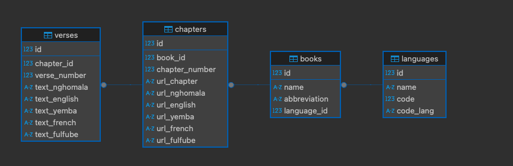

# BibleScrapingUMMISCO

Merci pour les détails du projet ! Voici un brouillon de fichier `README.md` structuré et détaillé pour ton projet : 

---

# BibleScrapingUMMISCO

## Description

**BibleScrapingUMMISCO** est un module conçu pour l'extraction des versets bibliques du site [Bible.com](https://www.bible.com). Le projet permet de scraper les versets bibliques et de les stocker dans une base de données PostgreSQL bien modélisée, suivant le schéma suivant :

- **Languages** : pour stocker les informations sur les langues.
- **Books** : pour les différents livres bibliques.
- **Chapters** : pour les chapitres des livres.
- **Verses** : pour les versets.

Grâce à ce projet, vous pouvez :
1. Extraire les données bibliques dans une langue spécifique.
2. Stocker les données dans une base PostgreSQL.
3. Exporter les données vers plusieurs formats (CSV, TXT, XML).

---

## Prérequis

### Logiciels requis :
- Python (version 3.8+)
- PostgreSQL
- Bibliothèques Python (listées dans `requirements.txt`)

Installez les dépendances Python avec la commande suivante :

```bash
pip install -r requirements.txt
```

---

## Schéma de la base de données



---

## Configuration et exécution

### Étape 1 : Créer la base de données
1. Créez une base de données PostgreSQL.
2. Utilisez le fichier `create_tables.py` pour créer les tables requises. Exécutez le fichier avec :

```bash
python create_tables.py
```

### Étape 2 : Remplir les tables statiques
- **Table `books`** :
  Remplissez les livres de la Bible en exécutant le fichier :

  ```bash
  python insert_books.py
  ```

- **Table `chapters`** :
  Ajoutez les numéros de chapitres associés aux livres en exécutant :

  ```bash
  python insert_chapter_number.py
  ```

### Étape 3 : Générer les URL pour les chapitres
1. Identifiez la langue que vous voulez scraper sur [Bible.com](https://www.bible.com) et ajoutez ses informations dans la table `languages` (notamment `code` et `code_lang`).
2. Modifiez le fichier `built_url_chapter.py` :
   - Ajoutez une colonne (par exemple, `url_french`) pour la langue cible dans la table `chapters`.
   - Mettez à jour la requête d'insertion pour inclure cette colonne.
3. Exécutez le fichier pour générer les URLs dans la base :

```bash
python built_url_chapter.py
```

### Étape 4 : Scraper les versets
1. Ajoutez une colonne dans la table `verses` pour stocker les versets de votre langue cible (par exemple, `text_french`).
2. Modifiez le fichier `spider2.py` :
   - Mettez à jour la requête d'insertion pour pointer vers la nouvelle colonne.
3. Lancez le spider pour scraper les versets et les insérer dans la base :

```bash
scrapy runspider spider2.py
```

### Étape 5 : Exporter les données
Utilisez le fichier `export_data.py` pour extraire les colonnes nécessaires et exporter les données sous trois formats différents : CSV, TXT et XML. Vous pouvez personnaliser les colonnes à exporter en modifiant le script.

Exécutez le fichier avec :

```bash
python export_data.py
```

---

## Détail des fichiers

- **`create_tables.py`** : Script pour créer les tables dans la base PostgreSQL.
- **`insert_books.py`** : Remplit la table `books` avec les informations des livres bibliques.
- **`insert_chapter_number.py`** : Ajoute les chapitres pour chaque livre dans la table `chapters`.
- **`built_url_chapter.py`** : Génère les URLs des chapitres pour une langue spécifique.
- **`spider2.py`** : Scrape les versets et les insère dans la table `verses`.
- **`export_data.py`** : Exporte les données des versets dans plusieurs formats (CSV, TXT, XML).
- **`settings.py`** : Contient les paramètres de configuration pour Scrapy et la connexion à la base PostgreSQL.
- **`requirements.txt`** : Liste des bibliothèques Python nécessaires au projet.

---

## Exemple de flux d'utilisation

### Cas d'utilisation : Scraper les versets en français
1. Ajoutez les informations pour la langue française dans la table `languages` (par exemple, `code=1`, `code_lang=fr`).
2. Modifiez le fichier `built_url_chapter.py` pour inclure une colonne `url_french`.
3. Exécutez `built_url_chapter.py` pour générer les URLs des chapitres français.
4. Ajoutez une colonne `text_french` dans la table `verses` et modifiez `spider2.py` pour insérer les versets dans cette colonne.
5. Lancez le spider pour scraper et insérer les versets français.
6. Exportez les données avec `export_data.py`.

---

## Auteurs
Projet développé par **Emeric Cyrille**.

---

Est-ce que cela correspond à tes attentes ? Si tu souhaites ajouter ou modifier quelque chose, dis-le-moi !
